# BPMN Observa ATT

## Visão Geral dos Processos de Negócio

O Observa ATT implementa um conjunto de processos operacionais centrados em registro de sinistros, validação de dados, persistência híbrida, administração, sincronização e geração de relatórios. A análise do repositório mostra que o sistema não possui cadastro tradicional de usuários finais. O acesso é aberto para operação comum e restringido por chave apenas nas funções administrativas.

Os processos identificados no sistema são:

1. Cadastro de usuários ou perfis de acesso administrativos: não implementado como cadastro formal; o sistema usa autenticação por chave administrativa.
2. Autenticação administrativa.
3. Registro de acidente.
4. Validação de informações do sinistro.
5. Atualização de registros e listagem em tempo real.
6. Geração de indicadores operacionais.
7. Geração de relatórios e exportações.
8. Administração do sistema.
9. Sincronização local com Supabase.
10. Sincronização de arquivos com Supabase Storage.
11. Bootstrap inicial a partir do JSON local.
12. Operação offline e sincronização posterior.
13. Instalação e atualização do PWA.
14. Exclusão de registros desativada por regra de negócio.

---

## Premissas de Notação

Os diagramas abaixo estão em sintaxe Mermaid usando `flowchart` para representar os fluxos BPMN de forma legível dentro do Markdown. A modelagem inclui eventos, atividades, decisões e saídas, com noção de participantes por agrupamento textual.

---

## 1. Cadastro de Usuários / Perfis de Acesso

### Status no sistema

Não há processo formal de cadastro de usuários no repositório. O que existe é autenticação administrativa por chave para habilitar recursos restritos.

### Nome do processo

Cadastro de usuários: não implementado

### Objetivo

O sistema não mantém cadastro de contas de usuário finais. O acesso é aberto para uso comum e o perfil administrativo é ativado por chave.

### Atores envolvidos

- Usuário comum
- Administrador
- Backend Flask

### Eventos de início

- Acesso ao sistema pela interface web.

### Eventos intermediários

- Usuário acessa a funcionalidade de autenticação administrativa.

### Eventos de término

- Perfil administrativo habilitado ou acesso comum mantido.

### Entradas

- Chave administrativa digitada pelo operador.

### Saídas

- Sessão administrativa habilitada ou rejeitada.

### Aprovações

- Validação da chave em `POST /api/admin/auth`.

### Validações

- Comparação da chave informada com `ADMIN_ACCESS_KEY`.

### Regras de negócio

- Não existe auto-cadastro de usuários.
- O acesso sensível depende de chave administrativa.

### Diagrama Mermaid

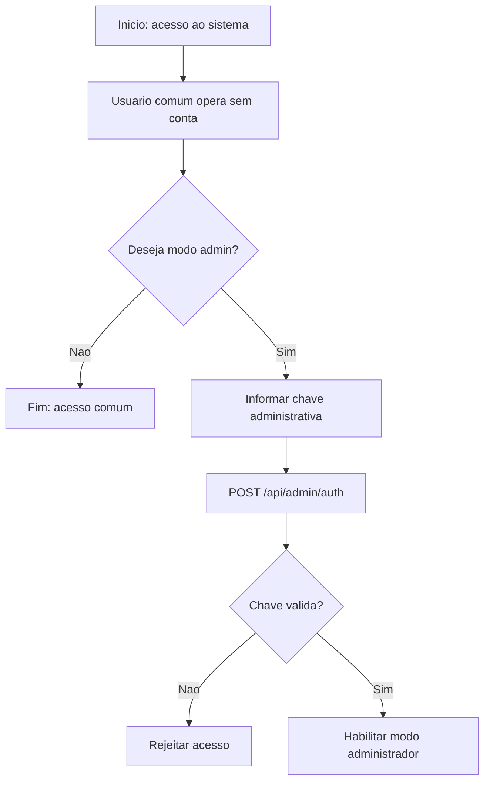

---

## 2. Autenticação Administrativa

### Nome do processo

Autenticação administrativa

### Objetivo

Permitir que apenas operadores autorizados acessem exportações, backup e diagnósticos do Supabase.

### Atores envolvidos

- Administrador
- Frontend web
- Backend Flask

### Eventos de início

- Clique em "Entrar como administrador".

### Eventos intermediários

- Prompt de chave no frontend.
- Requisição `POST /api/admin/auth`.
- Resposta de sucesso ou falha.

### Eventos de término

- Modo admin ativo ou acesso negado.

### Entradas

- Chave de administrador.

### Saídas

- `success: true` e modo admin habilitado.
- `403` com erro de chave inválida.

### Aprovações

- Validação do backend.

### Validações

- `X-Admin-Key` comparado com `ADMIN_ACCESS_KEY`.

### Regras de negócio

- Sem `ADMIN_ACCESS_KEY` configurada, o endpoint retorna erro de configuração.
- A chave é guardada no `localStorage` apenas para manter a sessão no navegador.

### Diagrama Mermaid

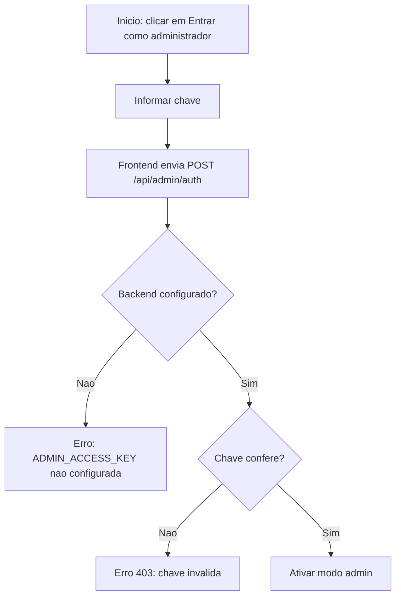

---

## 3. Registro de Acidente

### Nome do processo

Registro de acidente

### Objetivo

Capturar e persistir um sinistro com geolocalização, fotos, classificação operacional e trilha de auditoria.

### Atores envolvidos

- Usuário notificante
- Frontend web/PWA
- Backend Flask
- Supabase
- GitHub Backup

### Eventos de início

- Usuario preenche o formulário de novo sinistro.

### Eventos intermediários

- Captura de localização.
- Captura de fotos.
- Validação de campos obrigatórios.
- Envio para API.
- Persistência local.
- Persistência remota no Supabase.
- Geração de exportações.
- Backup opcional no GitHub.

### Eventos de término

- Registro salvo com sucesso, ou salvo localmente com aviso de sincronização pendente.

### Entradas

- Município de notificação.
- Instituição notificadora.
- Endereço.
- Veículo/Usuário.
- Sinistro com vítimas.
- Perfil das vítimas.
- Equipamentos de segurança.
- Latitude e longitude.
- Indicação de registro no local ou fora dele.
- Fotos.
- Tempo de registro.

### Saídas

- Registro salvo.
- ID do acidente.
- Atualização da listagem.
- Exportações atualizadas.

### Aprovações

- Aceite do backend após validações.
- Upsert no Supabase quando disponível.

### Validações

- Município obrigatório.
- Formato e normalização de campos textuais.
- Normalização de sim/não.
- Limite de fotos: máximo 5.
- Limite de tamanho de foto em base64.
- Perfil de vítimas obrigatório quando sinistro com vítimas = Sim.
- Descrição obrigatória quando o registro é fora do local.

### Regras de negócio

- Registros são permanentes; exclusão está desativada.
- O payload bruto é salvo em trilha de resgate para auditoria.
- Se houver falha de Supabase, o registro permanece no espelho local.
- O sistema gera exports após cada gravação bem sucedida.

### Diagrama Mermaid

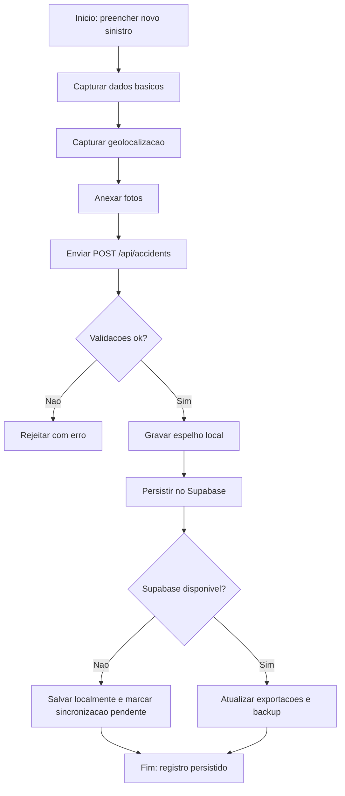

---

## 4. Validação de Informações

### Nome do processo

Validação de informações do sinistro

### Objetivo

Garantir consistência mínima do dado antes da persistência e evitar registros estruturalmente inválidos.

### Atores envolvidos

- Usuário notificante
- Frontend web
- Backend Flask

### Eventos de início

- Envio do formulário.

### Eventos intermediários

- Normalização de valores.
- Checagem de obrigatoriedade.
- Regras condicionais por campo.

### Eventos de término

- Payload aceito ou rejeitado.

### Entradas

- Payload JSON do formulário.

### Saídas

- Registro normalizado.
- Erro 400 quando os dados mínimos não são atendidos.

### Aprovações

- Aprovado quando o backend confirma os campos mínimos.

### Validações

- JSON deve ser objeto.
- Campo `municipioNotificacao` obrigatório.
- `veiculoUsuario` precisa ter ao menos um valor.
- `sinistroComVitimas` ajusta obrigatoriedade do perfil das vítimas.
- `registroNoLocalSinistro` controla a obrigatoriedade de descrição complementar.
- `fotos` deve ser lista com no máximo 5 itens válidos.

### Regras de negócio

- Valores são compatibilizados entre nomenclaturas antigas e novas.
- O backend aceita sinônimos de campos para manter compatibilidade com versões do frontend.

### Diagrama Mermaid

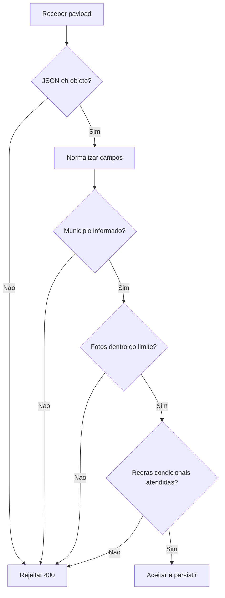

---

## 5. Atualização de Registros

### Nome do processo

Atualização de registros e listagem em tempo real

### Objetivo

Manter a interface sincronizada com o repositório de dados local e remoto.

### Atores envolvidos

- Frontend web
- Backend Flask
- SSE/EventSource

### Eventos de início

- Abertura da tela.
- Mudança no estado da conexão.
- Emissão de evento de criação de acidente.

### Eventos intermediários

- Polling em `/api/accidents/meta`.
- Conexão SSE em `/api/accidents/stream`.
- Recarregamento silencioso da lista.

### Eventos de término

- Lista atualizada.

### Entradas

- Fingerprint de metadados.
- Eventos SSE.

### Saídas

- Tabela atualizada.
- Indicador de status do stream.

### Aprovações

- Aceite implícito quando o backend retorna os dados e a fingerprint muda.

### Validações

- Verificação de conectividade.
- Comparação de fingerprint para evitar recarga desnecessária.

### Regras de negócio

- Se a API falhar, usa cache local.
- Em estado offline, os pendentes são exibidos junto da lista local.

### Diagrama Mermaid

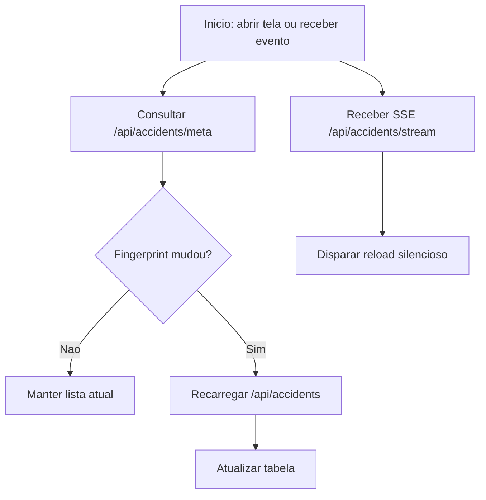

---

## 6. Geração de Indicadores

### Nome do processo

Geração de indicadores operacionais

### Objetivo

Produzir leituras resumidas da operação para suporte a monitoramento e decisão.

### Atores envolvidos

- Backend Flask
- Administrador

### Eventos de início

- Consulta da listagem.
- Consulta de `/api/accidents/meta`.
- Consulta de `/health`.

### Eventos intermediários

- Contagem total.
- Identificação do último registro.
- Status do Supabase.
- Status do storage em nuvem.

### Eventos de término

- Indicadores expostos via endpoints.

### Entradas

- Registros persistidos.
- Estado do storage.

### Saídas

- Total de ocorrências.
- Último registro.
- Fingerprint.
- Saúde do ambiente.

### Aprovações

- Nao há aprovação humana; a emissão é automática pelo backend.

### Validações

- Resposta da tabela Supabase.
- Presença de persistência/estado saudável.

### Regras de negócio

- `/health` retorna `503` se persistência obrigatória não estiver atendida.
- `mode` em `/health` aponta para `supabase` ou `local-json`.

### Diagrama Mermaid

```mermaid
flowchart TD
  A[Inicio: consultar indicadores] --> B[/api/accidents/meta]
  B --> C[Calcular total e fingerprint]
  A --> D[/health]
  D --> E[Determinar estado de persistencia e Supabase]
  C --> F[Exibir indicadores]
  E --> F
```

---

## 7. Geração de Relatórios

### Nome do processo

Geração de relatórios e exportações

### Objetivo

Gerar planilhas e mapas para análise administrativa e distribuição institucional.

### Atores envolvidos

- Administrador
- Backend Flask
- Supabase opcional

### Eventos de início

- Solicitação de exportação.
- Geração automática agendada.

### Eventos intermediários

- Classificação por período.
- Geração de CSV.
- Geração de mapa HTML.

### Eventos de término

- Arquivos prontos para download.

### Entradas

- Lista de acidentes.
- Período solicitado.

### Saídas

- `acidentes_diario_latest.csv`
- `acidentes_semanal_latest.csv`
- `acidentes_mensal_latest.csv`
- `mapa_pe_diario_latest.html`

### Aprovações

- Acesso restrito ao administrador.

### Validações

- Requisição precisa vir com `X-Admin-Key` válido.
- Periodicidade deve ser daily, weekly ou monthly.

### Regras de negócio

- O relatório diário pode ser gerado automaticamente pelo scheduler.
- O mapa diário depende da presença de coordenadas válidas.

### Diagrama Mermaid

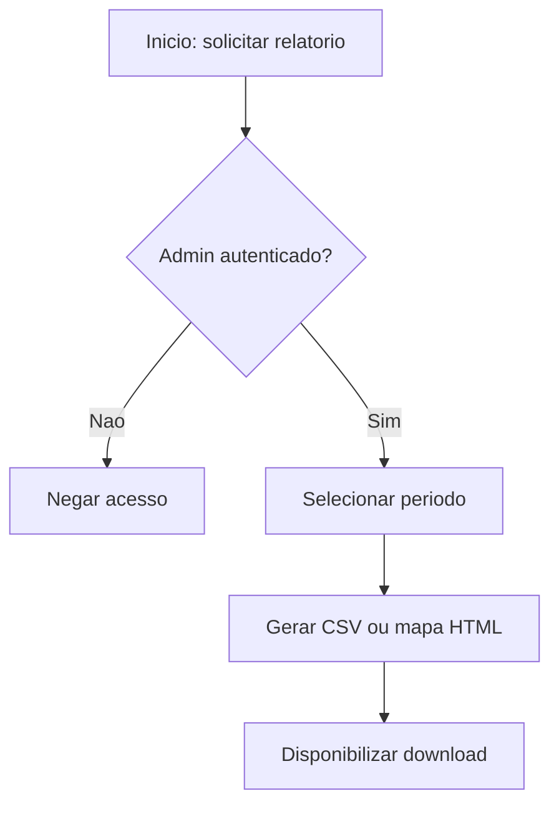

---

## 8. Administração do Sistema

### Nome do processo

Administração do sistema

### Objetivo

Executar tarefas de governança, backup, diagnóstico e integração com armazenamento remoto.

### Atores envolvidos

- Administrador
- Backend Flask
- Supabase
- GitHub

### Eventos de início

- Autenticação administrativa concluída.

### Eventos intermediários

- Abrir tabela no Supabase.
- Consultar status do Supabase.
- Executar backup privado.
- Sincronizar armazenamento em nuvem.

### Eventos de término

- Artefatos administrativos gerados e estado de backup/sync atualizado.

### Entradas

- Chave administrativa.
- Configurações Supabase e GitHub.

### Saídas

- Link da tabela Supabase.
- Backup privado.
- Diagnóstico de saúde.
- Sincronização de arquivos.

### Aprovações

- Validação admin e credenciais externas válidas.

### Validações

- Admin autenticado.
- Supabase configurado.
- Bucket configurado para storage sync.
- Token GitHub válido para backup.

### Regras de negócio

- Operações sensíveis não devem ser executadas por usuários comuns.
- `SUPABASE_SERVICE_ROLE_KEY` permanece somente no backend.

### Diagrama Mermaid

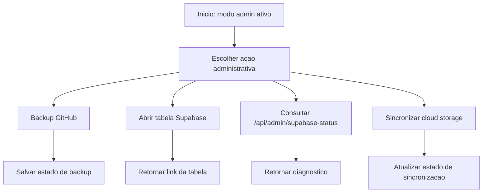

---

## 9. Sincronização Local com Supabase

### Nome do processo

Sincronização local com Supabase

### Objetivo

Enviar registros ausentes do espelho local para a tabela remota e manter consistência entre as camadas.

### Atores envolvidos

- Backend Flask
- Supabase

### Eventos de início

- Startup da aplicação.
- Gravação de novo sinistro.
- Execução manual/forçada.

### Eventos intermediários

- Leitura do espelho local.
- Comparação de IDs remotos.
- Upsert em lote.

### Eventos de término

- Registros sincronizados ou pendentes.

### Entradas

- Registros locais.
- Registros remotos.

### Saídas

- Upsert em `acidentes`.
- Lista de pendências e colunas removidas por compatibilidade.

### Aprovações

- Permissão implícita do backend quando credenciais existem.

### Validações

- Se a instância Supabase não estiver disponível, o fluxo cai em fallback local.

### Regras de negócio

- A sincronização é throttled por intervalo.
- O upsert é resiliente a colunas ausentes.

### Diagrama Mermaid

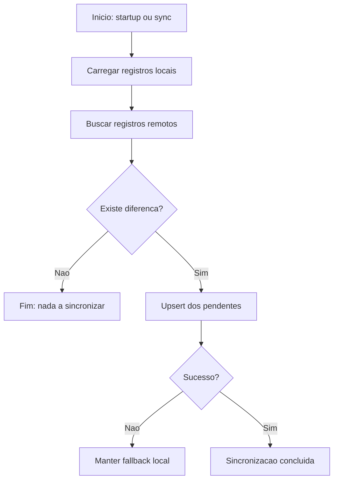

---

## 10. Sincronização de Arquivos com Supabase Storage

### Nome do processo

Sincronização de arquivos com Supabase Storage

### Objetivo

Publicar artefatos operacionais em storage remoto quando habilitado.

### Atores envolvidos

- Backend Flask
- Supabase Storage

### Eventos de início

- Gravação local de arquivos.
- Ação administrativa manual.

### Eventos intermediários

- Listagem de arquivos candidatos.
- Cálculo de fingerprint.
- Upload com upsert.

### Eventos de término

- Arquivos enviados ou sincronização ignorada por throttle.

### Entradas

- Arquivos locais em `exports/`, JSON espelho, backups e estado.

### Saídas

- Upload remoto com estado de último sync.

### Aprovações

- Storage configurado e habilitado.

### Validações

- `SUPABASE_STORAGE_SYNC_ENABLED`.
- `SUPABASE_STORAGE_BUCKET`.

### Regras de negócio

- Sem bucket configurado, o sync de storage é desativado.

### Diagrama Mermaid

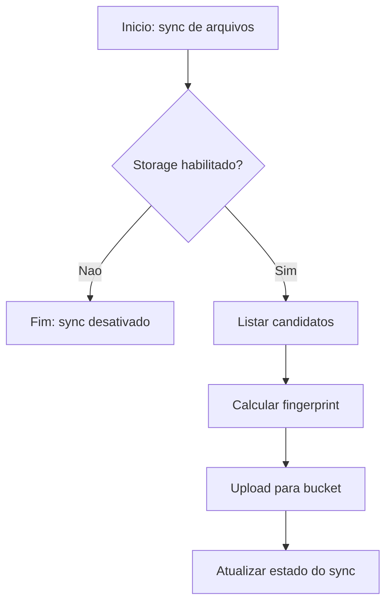

---

## 11. Bootstrap Inicial a Partir do JSON Local

### Nome do processo

Bootstrap inicial Supabase a partir do arquivo local

### Objetivo

Popular a tabela remota quando ela estiver vazia, usando o espelho local como fonte inicial.

### Atores envolvidos

- Backend Flask
- Supabase

### Eventos de início

- Startup da aplicação.

### Eventos intermediários

- Verificação de existência de registros no Supabase.
- Leitura do arquivo local.
- Inserção inicial.

### Eventos de término

- Base remota populada ou bootstrap ignorado.

### Entradas

- JSON local de acidentes.

### Saídas

- Inserção inicial na tabela `acidentes`.

### Aprovações

- Supabase deve estar disponível e configurado.

### Validações

- Somente executa se `SUPABASE_BOOTSTRAP_LOCAL` for verdadeiro.

### Regras de negócio

- Só executa se a tabela remota estiver vazia.

### Diagrama Mermaid

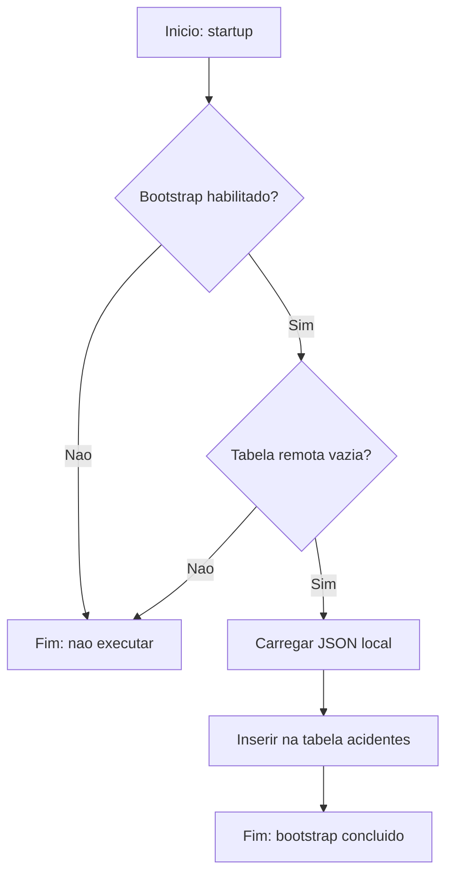

---

## 12. Operação Offline e Sincronização Posterior

### Nome do processo

Operação offline e sincronização posterior

### Objetivo

Permitir continuidade do uso mesmo sem conectividade.

### Atores envolvidos

- Usuário notificante
- Frontend web/PWA
- Backend Flask

### Eventos de início

- Falta de internet ou falha de envio.

### Eventos intermediários

- Registro salvo em fila local.
- Exibição de cache local.
- Reenvio automático/manual quando a conexão retorna.

### Eventos de término

- Fila esvaziada e registros integrados ao backend.

### Entradas

- Payload do sinistro.

### Saídas

- Registro pendente e posterior sincronização.

### Aprovações

- Não há aprovação humana; a confirmação ocorre ao restabelecer a conexão.

### Validações

- Verificação de `navigator.onLine`.

### Regras de negócio

- Se a rede falhar, o registro é salvo localmente.
- A sincronização não deve apagar a fila em caso de erro parcial.

### Diagrama Mermaid

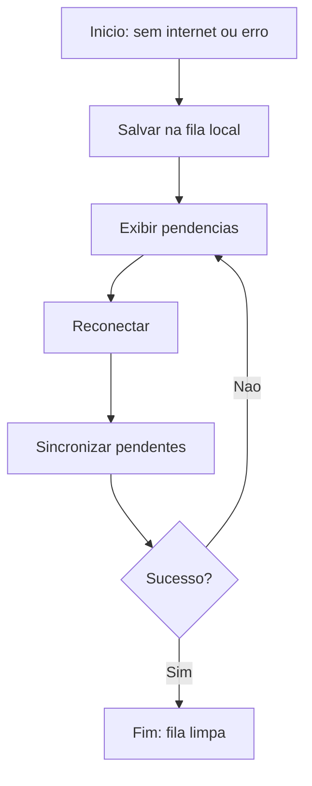

---

## 13. Instalação e Atualização do PWA

### Nome do processo

Instalação e atualização do PWA

### Objetivo

Permitir uso como app instalado e manter os clientes atualizados.

### Atores envolvidos

- Usuário mobile
- Service Worker
- Frontend web

### Eventos de início

- Acesso ao site.
- Evento `beforeinstallprompt`.
- Detecção de nova versão.

### Eventos intermediários

- Exibição de banner de instalação.
- Instalação aceitada.
- `SKIP_WAITING`.
- `controllerchange`.

### Eventos de término

- App instalado ou atualizado.

### Entradas

- Evento do navegador.

### Saídas

- Instalação standalone.
- Reload da nova versão.

### Aprovações

- Aceite do usuário para instalação.

### Validações

- Disponibilidade do `beforeinstallprompt`.
- Controle do Service Worker.

### Regras de negócio

- Quando o app já está instalado, banners de instalação são ocultados.
- Atualizações fazem reload coordenado.

### Diagrama Mermaid

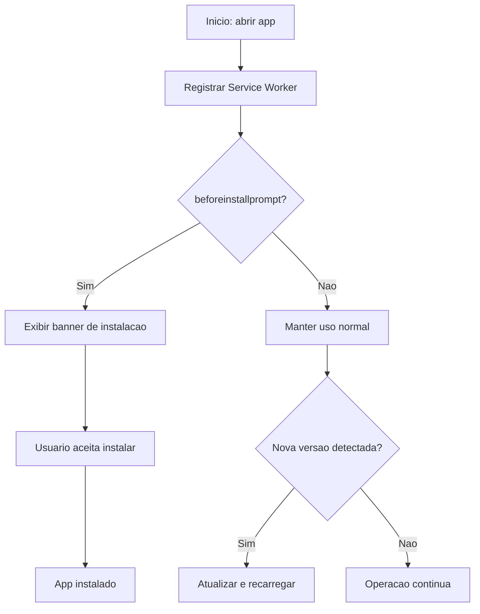

---

## 14. Exclusão de Registros

### Nome do processo

Exclusão de registros desativada

### Objetivo

Bloquear remoção de ocorrências e manter a rastreabilidade histórica.

### Atores envolvidos

- Qualquer usuário que tente deletar
- Backend Flask

### Eventos de início

- Requisição `DELETE /api/accidents/<id>`.

### Eventos intermediários

- Backend avalia regra de negócio.

### Eventos de término

- Requisição rejeitada com `403`.

### Entradas

- ID do acidente.

### Saídas

- Mensagem de remoção desativada.

### Aprovações

- Nenhuma; processo sempre rejeitado.

### Validações

- Regra fixa de permanência dos dados.

### Regras de negócio

- Os registros são permanentes.
- A exclusão não é permitida.

### Diagrama Mermaid

```mermaid
flowchart TD
  A[Inicio: DELETE /api/accidents/{id}] --> B[Validar regra de permanencia]
  B --> C[Rejeitar operacao]
  C --> D[Fim: retorno 403]
```

---

## 15. Fluxos Adicionais Identificados Automaticamente

### 15.1 Leitura de acidentes

- Entrada: requisição `GET /api/accidents`.
- Saída: lista atual de registros.
- Regra: prioriza Supabase quando disponível, com fallback local.

### 15.2 Metadados de acidentes

- Entrada: requisição `GET /api/accidents/meta`.
- Saída: total, último ID, última data/hora, fingerprint.

### 15.3 Fluxo de saúde do ambiente

- Entrada: requisição `GET /health`.
- Saída: status do storage, persistência e saúde geral.

### 15.4 Fluxo de exportações administrativas

- Entrada: requisição `GET /api/exports` ou downloads específicos.
- Saída: CSVs, mapa diário, estado do backup.

### 15.5 Fluxo de diagnóstico Supabase

- Entrada: requisição `GET /api/admin/supabase-status`.
- Saída: diagnóstico, conectividade, acessibilidade da tabela e estado do storage.

### 15.6 Fluxo de sincronização manual do storage

- Entrada: requisição `POST /api/admin/cloud-storage-sync`.
- Saída: resultado da sincronização de arquivos.

---

## 16. Visão Geral Consolidada dos Fluxos de Negócio

O Observa ATT opera como uma cadeia de processos interdependentes:

1. O usuário entra no sistema sem cadastro formal.
2. O fluxo de autenticação administrativa habilita recursos sensíveis.
3. O sinistro é validado, normalizado e persistido.
4. O backend mantém espelho local, sincroniza com Supabase e preserva trilhas de resgate.
5. A listagem é atualizada por polling, SSE e cache local.
6. O sistema gera indicadores, planilhas e mapas.
7. O administrador executa ações de governança, diagnóstico e backup.
8. O PWA garante instalação, cache e atualização coordenada.
9. A exclusão permanece desativada para preservar histórico e auditoria.

---

## 17. Conclusão

O sistema implementa um conjunto claro de processos de negócio voltados para registro de acidentes, governança de dados e operação resiliente. A principal característica do Observa ATT é a combinação de captura de campo, persistência híbrida e administração restrita, com forte ênfase em rastreabilidade e continuidade operacional.