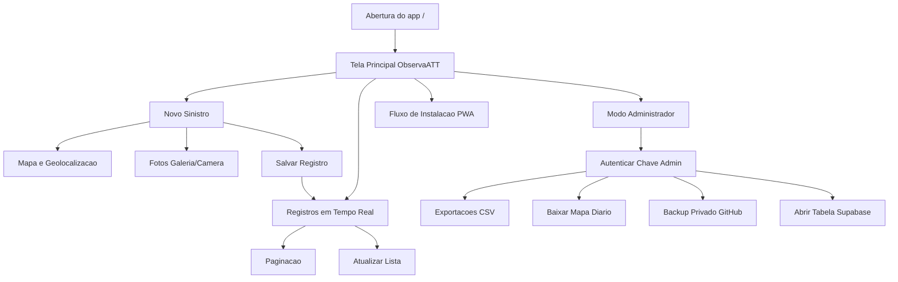
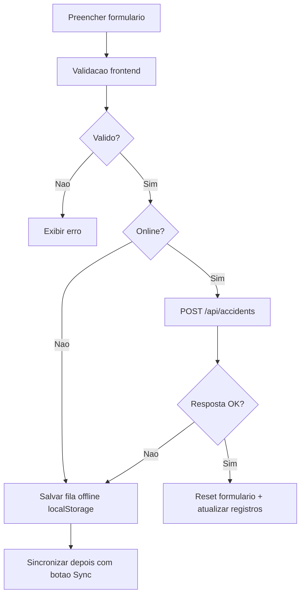
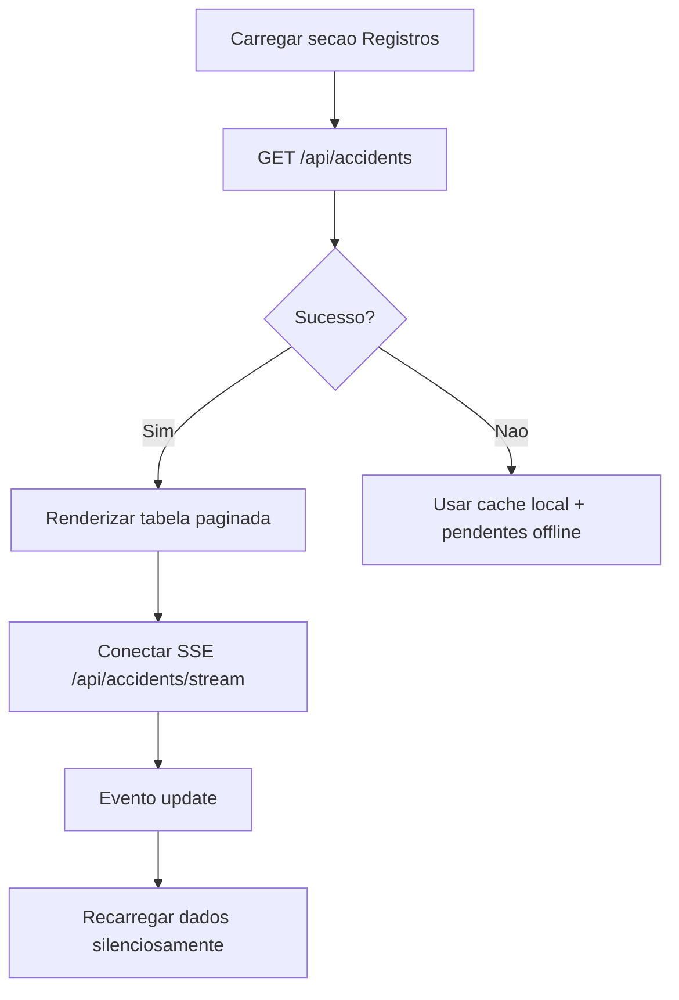
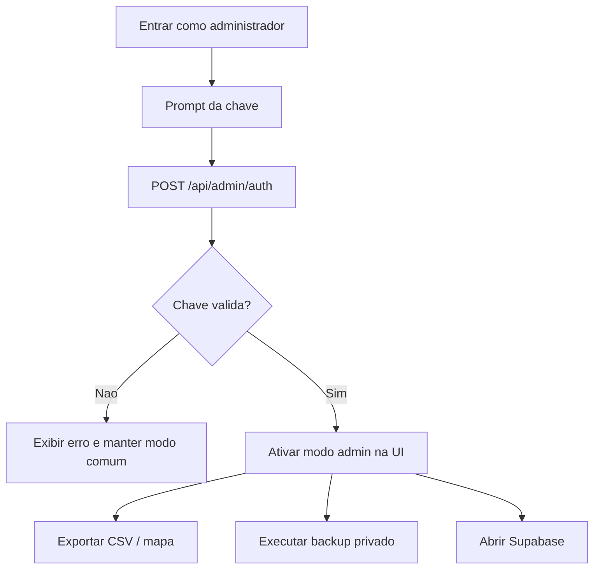
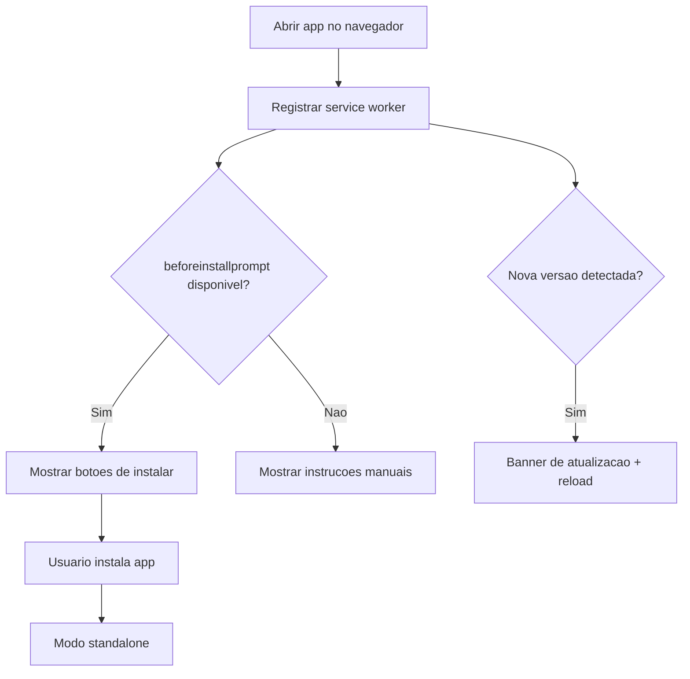
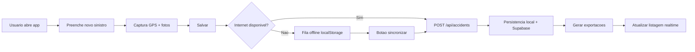

# Prototipos e Fluxos de Interface - Sistema Observa ATT

## Sumario Executivo
O Observa ATT foi construido com arquitetura de interface centrada em uma pagina operacional unica, responsiva e orientada ao uso em campo, com suporte a funcionamento offline, geolocalizacao em tempo real, captura de fotos, sincronizacao posterior e recursos administrativos protegidos por chave.

A experiencia de uso foi estruturada para dois perfis principais:

1. Operacao de notificacao de sinistro (uso cotidiano).
2. Gestao administrativa (exportacoes, backup e governanca de dados).

A navegacao e predominantemente por estados dentro da propria tela (sem roteamento multipagina classico), o que reduz friccao para registro rapido em situacoes reais. O projeto tambem preserva um prototipo institucional e uma interface legada, que registram a evolucao de UX e regras de negocio.

---

## 1. Escopo da Analise Frontend
Esta documentacao foi gerada a partir da analise integral dos artefatos de interface e dos endpoints consumidos pelo frontend:

- web/index_simple.html (frontend principal em producao)
- web/sw.js (service worker e politica de cache/update)
- web/manifest.json (metadados PWA e instalacao)
- index_simple.html (interface legada)
- index.html (shell de bootstrap Flutter Web)
- docs/prototipo/observa-att-prototipo.html (prototipo institucional)
- server.py (rotas, autenticacao admin, exportacoes, stream realtime)
- capacitor.config.ts (empacotamento iOS com backend remoto)

---

## 2. Perfis de Usuario
### 2.1 Notificante Operacional
Objetivo:
Registrar sinistros com dados estruturados, localizacao, fotos e contexto de vitimas.

Permissoes:
- Preencher e salvar registro.
- Usar GPS pontual e rastreamento continuo.
- Trabalhar offline e sincronizar depois.
- Consultar listagem de registros em tempo real.

### 2.2 Administrador
Objetivo:
Executar operacoes de governanca e distribuicao de dados.

Permissoes (apos autenticacao por chave):
- Download de planilha diaria, semanal e mensal.
- Download de mapa diario em HTML.
- Disparo de backup privado no GitHub.
- Abertura direta da tabela de acidentes no Supabase.
- Consulta de status de integracoes (via APIs admin).

### 2.3 Gestor/Analista de Vigilancia
Objetivo:
Consumir saidas de monitoramento e exportacoes para analise epidemiologica e operacional.

Permissoes praticas:
- Consulta da listagem consolidada.
- Uso de relatorios exportados (CSV e mapa diario).

Observacao:
No codigo, esse perfil e atendido funcionalmente pelo modo administrador ou por consumo de artefatos exportados.

---

## 3. Mapa Geral de Navegacao

---

## 4. Inventario Completo de Telas, Paginas e Componentes

## 4.1 Tela Principal Operacional - ObservaATT PE
Origem:
web/index_simple.html

Nome da tela:
Tela Principal Operacional

Objetivo:
Centralizar captura de sinistros, visualizacao de registros, atualizacao em tempo real, operacao offline e acesso a recursos administrativos.

Campos existentes:
- municipioNotificacao
- nomeNotificante
- endereco
- veiculoUsuario (checkbox multipla selecao)
- sinistroComVitimas
- quantidadeVitimas (condicional)
- equipamentosSeguranca
- latitude
- longitude
- registroNoLocalSinistro
- registroForaLocalDescricao (condicional)
- fotos (galeria)
- fotosCamera (captura camera)
- live-timer (cronometro visual)

Acoes disponiveis:
- Salvar registro (submit)
- Rastrear em tempo real
- Usar localizacao atual
- Sincronizar registros offline
- Atualizar lista
- Navegar paginas (anterior/proxima)
- Baixar mapa diario (acao visivel na area de registros)
- Entrar como administrador
- Sair do modo admin
- Backup privado (admin)
- Abrir tabela Supabase (admin)
- Baixar planilhas (admin)
- Instalar app (PWA)
- Atualizar app quando houver nova versao

Fluxo de navegacao:
Abertura do app -> preenchimento de novo sinistro -> submissao (online ou offline) -> atualizacao da secao de registros -> operacoes adicionais (admin/PWA).

Componentes relevantes:
- update-banner
- install-banner
- card de formulario
- card de registros
- stream-status
- export-bar (admin)
- tabela paginada
- footer institucional

---

## 4.2 Subtela de Formulario - Novo Sinistro
Origem:
web/index_simple.html

Nome da tela:
Formulario de Registro de Sinistro

Objetivo:
Capturar dados estruturados e validaveis para persistencia local/remota.

Campos existentes:
- Municipio de notificacao
- Instituicao notificadora
- Endereco do sinistro
- Veiculo/Usuario (multiplos)
- Sinistro com vitimas (Sim/Nao)
- Perfil das vitimas (condicional, multiplos)
- Equipamentos de seguranca em uso
- Latitude e longitude
- Registro feito no local (Sim/Nao)
- Breve descricao quando fora do local
- Fotos (ate 5, com compressao)

Acoes disponiveis:
- Validar campos obrigatorios e condicionais.
- Enviar para POST /api/accidents.
- Salvar offline quando sem internet/falha de rede.
- Limpar formulario apos envio.

Fluxo de navegacao:
Preencher dados -> validar regras -> enviar.
- Se online: grava no backend e atualiza listagem.
- Se offline: enfileira localmente para sincronizacao posterior.

---

## 4.3 Subtela de Mapa e Geolocalizacao
Origem:
web/index_simple.html

Nome da tela:
Mapa de Pernambuco em Tempo Real

Objetivo:
Permitir marcacao geografica precisa do sinistro com interacao por mapa e GPS.

Campos existentes:
- latitude
- longitude

Acoes disponiveis:
- Usar localizacao atual (geolocation getCurrentPosition)
- Rastrear em tempo real (watchPosition, toggle iniciar/parar)
- Clicar no mapa para ajustar ponto
- Recentrar com foco em nivel de rua

Fluxo de navegacao:
Usuario aciona localizacao -> mapa Leaflet carrega -> coordenadas atualizadas nos campos -> ponto exibido com marcador e circulo de foco/precisao.

---

## 4.4 Subtela de Midia - Fotos do Sinistro
Origem:
web/index_simple.html

Nome da tela:
Captura de Fotos

Objetivo:
Anexar evidencias visuais com baixo custo de banda.

Campos existentes:
- Input de arquivos da galeria
- Input de captura da camera
- Area de preview (preview-grid)

Acoes disponiveis:
- Alternar entre aba Galeria e Camera
- Selecionar arquivos
- Comprimir imagens no cliente
- Visualizar miniaturas antes do envio

Fluxo de navegacao:
Escolha da fonte de foto -> leitura local -> compressao -> preview -> incorporacao ao payload de envio.

---

## 4.5 Subtela de Registros - Lista, Tempo Real e Paginacao
Origem:
web/index_simple.html

Nome da tela:
Registros

Objetivo:
Exibir historico operacional com atualizacao quase imediata e resiliencia offline.

Campos exibidos:
- Data/Hora
- Municipio
- Veiculo/Usuario
- Tempo de registro
- Indicador offline (quando aplicavel)

Acoes disponiveis:
- Atualizar lista manualmente
- Receber atualizacoes por EventSource (/api/accidents/stream)
- Paginar de 10 em 10
- Exibir status de conexao realtime

Fluxo de navegacao:
Carregamento inicial -> leitura de /api/accidents -> renderizacao paginada.
Se houver indisponibilidade, usar cache local e itens pendentes offline.

---

## 4.6 Subtela Administrativa
Origem:
web/index_simple.html + server.py

Nome da tela:
Modo Administrador

Objetivo:
Restringir funcionalidades de exportacao, backup e operacoes sensiveis.

Campos existentes:
- Chave administrativa (capturada por prompt)

Acoes disponiveis:
- Entrar como administrador (POST /api/admin/auth)
- Sair do modo admin
- Baixar planilha diaria (GET /api/exports/download/daily)
- Baixar planilha semanal (GET /api/exports/download/weekly)
- Baixar planilha mensal (GET /api/exports/download/monthly)
- Baixar mapa diario (GET /api/exports/download/daily-map)
- Backup privado GitHub (POST /api/admin/backup-now)
- Abrir tabela de acidentes no Supabase (GET /api/admin/spreadsheets-link)

Fluxo de navegacao:
Usuario clica em Entrar como administrador -> informa chave -> backend valida.
Se valido, barra de exportacao e botoes restritos sao exibidos.

---

## 4.7 Subtela de Instalacao PWA
Origem:
web/index_simple.html + web/manifest.json + web/sw.js

Nome da tela:
Instalacao e Atualizacao PWA

Objetivo:
Transformar o sistema em app instalavel no celular com politica de cache e atualizacao controlada.

Campos/elementos existentes:
- install-banner
- btn-banner-install
- btn-banner-help
- btn-install
- install-status
- update-banner
- btn-update-reload

Acoes disponiveis:
- Instalar automaticamente quando beforeinstallprompt esta disponivel
- Exibir instrucoes de instalacao manual
- Fechar banner de instalacao
- Detectar nova versao por service worker
- Aplicar atualizacao com reload

Fluxo de navegacao:
Acesso inicial -> sugestao de instalacao -> instalacao manual/automatica -> uso em modo standalone.
Quando ha nova versao do SW, app sinaliza e recarrega para aplicar cache novo.

---

## 4.8 Tela Legada - Interface Simples
Origem:
index_simple.html

Nome da tela:
ObservaATT Legado (modal de registro)

Objetivo:
Versao anterior da experiencia, com fluxo de cadastro via modal e listagem simples.

Campos existentes:
- Endereco do sinistro
- Latitude
- Longitude
- Instituicao
- Nome do notificante
- Breve descricao
- Fotos (galeria e camera)

Acoes disponiveis:
- Abrir modal Novo Sinistro
- Marcar localizacao atual
- Salvar sinistro
- Fechar modal
- Exibir notificacoes de status
- Renderizar lista de acidentes

Fluxo de navegacao:
Home -> abrir modal -> preencher -> enviar para API -> atualizar lista.

---

## 4.9 Shell Flutter Web
Origem:
index.html

Nome da tela:
Bootstrap Flutter Web

Objetivo:
Inicializar runtime Flutter para cenarios em que o frontend seja empacotado como app Flutter Web.

Campos existentes:
Nao se aplica.

Acoes disponiveis:
- Carregar flutter.js
- Inicializar engine
- Executar app

Fluxo de navegacao:
Entrada HTML -> loadEntrypoint -> initializeEngine -> runApp.

---

## 4.10 Prototipo Institucional de Referencia
Origem:
docs/prototipo/observa-att-prototipo.html

Nome da tela:
Prototipo Funcional Institucional

Objetivo:
Apoiar discussao com negocio e TI sobre painel operacional, registro de sinistro, fluxo e modelo de dados.

Campos existentes:
- Municipio
- Nome notificante
- Endereco
- Veiculo/Usuario
- Sinistro com vitimas
- Descricao

Acoes disponiveis:
- Salvar registro (simulado)
- Anexar fotos (simulado)
- Cancelar
- Navegar por itens de sidebar (Painel, Registro, Fluxo, Banco de Dados, Exportacoes, Administracao)

Fluxo de navegacao:
Sidebar -> visualizacao de secao conceitual -> simulacao de preenchimento e analise de KPIs/fluxo.

---

## 5. Menus, Formularios, Dashboards, Relatorios e Funcionalidades

## 5.1 Menus e pontos de acao
- Acoes do formulario (salvar, GPS, sync offline).
- Acoes da lista (atualizar, paginar, baixar mapa).
- Acoes administrativas (login/logout, backup, planilhas, Supabase).
- Acoes PWA (instalar, instrucoes, atualizar app).

## 5.2 Formularios identificados
- Formulario completo de Novo Sinistro (principal).
- Formulario modal legado (versao anterior).
- Prompt de autenticacao administrativa.

## 5.3 Dashboards e monitoramento
- Painel de registros em tempo real com status de conexao.
- Indicadores de modo online/offline e fila pendente.
- Cronometro de tempo de preenchimento por registro.

## 5.4 Relatorios e exportacoes
- CSV diario.
- CSV semanal.
- CSV mensal.
- Mapa diario de Pernambuco em HTML.

## 5.5 Funcionalidades transversais
- SSE para atualizacao realtime.
- Fila offline com sincronizacao posterior.
- Cache local de registros.
- Compressao de imagens no frontend.
- Controle de acesso por chave admin.
- PWA instalavel com service worker.

---

## 6. Fluxo Integrado Fim a Fim

---

## 7. Matriz de Cobertura da Solicitacao
1. Paginas, telas, componentes e fluxos identificados: concluido.
2. Finalidade de cada tela: concluido.
3. Perfis de usuario mapeados: concluido.
4. Menus, formularios, dashboards, relatorios e funcionalidades: concluido.
5. Documento Markdown Prototipos_Observa_ATT.md: concluido.
6. Cada tela com nome, objetivo, campos, acoes e fluxo: concluido.
7. Diagramas Mermaid de navegacao: concluido.
8. Sumario executivo para apresentacao: concluido.

---

## 8. Observacoes Tecnicas Importantes
- O frontend principal opera como SPA sem rotas internas tradicionais; os fluxos sao por transicao de estado na mesma pagina.
- A remocao de acidentes esta desativada por regra de negocio no backend.
- O modo administrador depende de ADMIN_ACCESS_KEY configurada no servidor.
- O uso mobile em iOS via Capacitor foi configurado para apontar ao backend HTTPS remoto.
